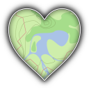
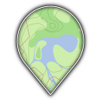
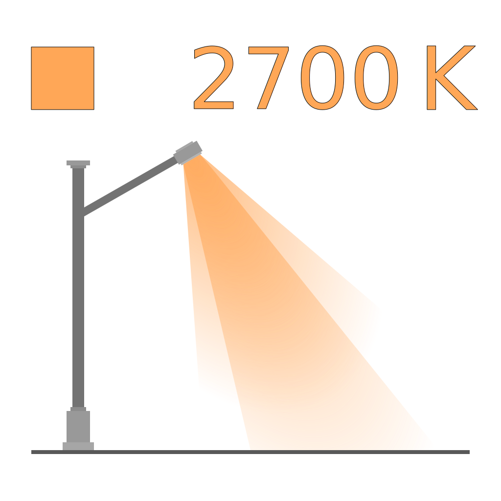
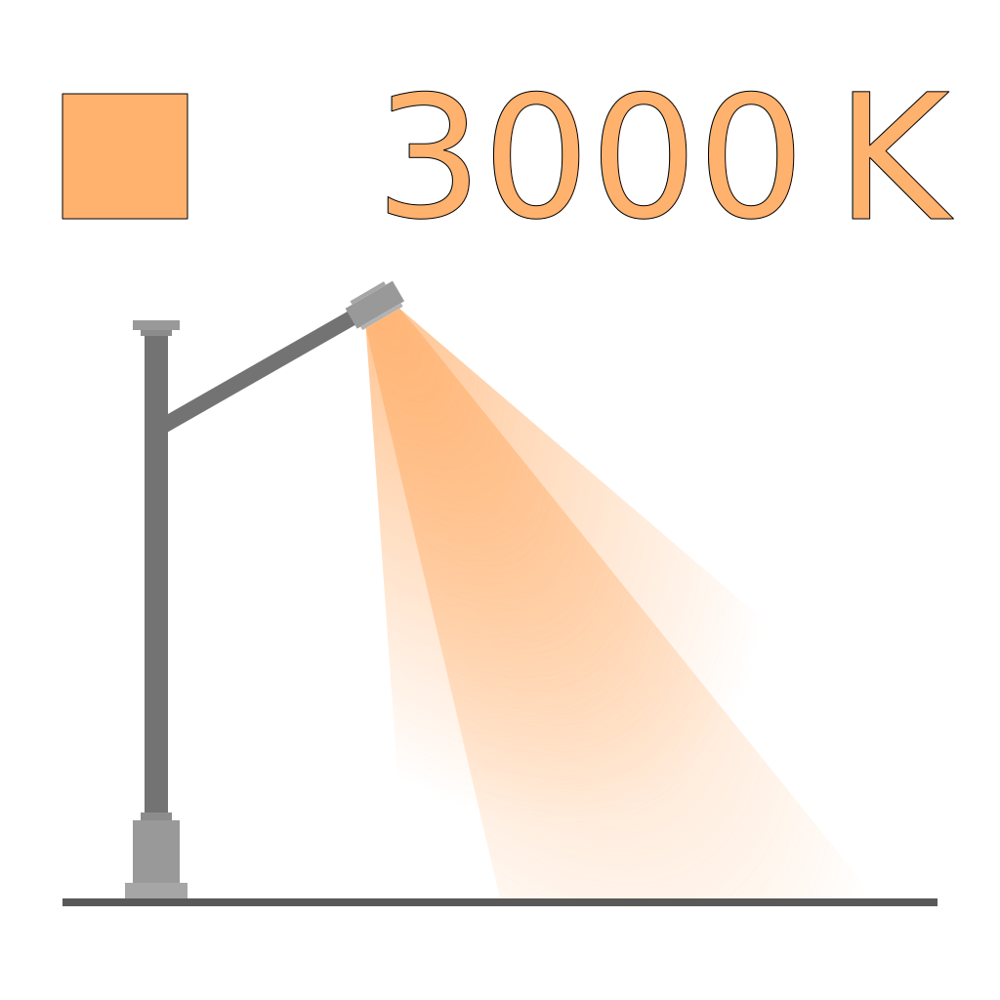
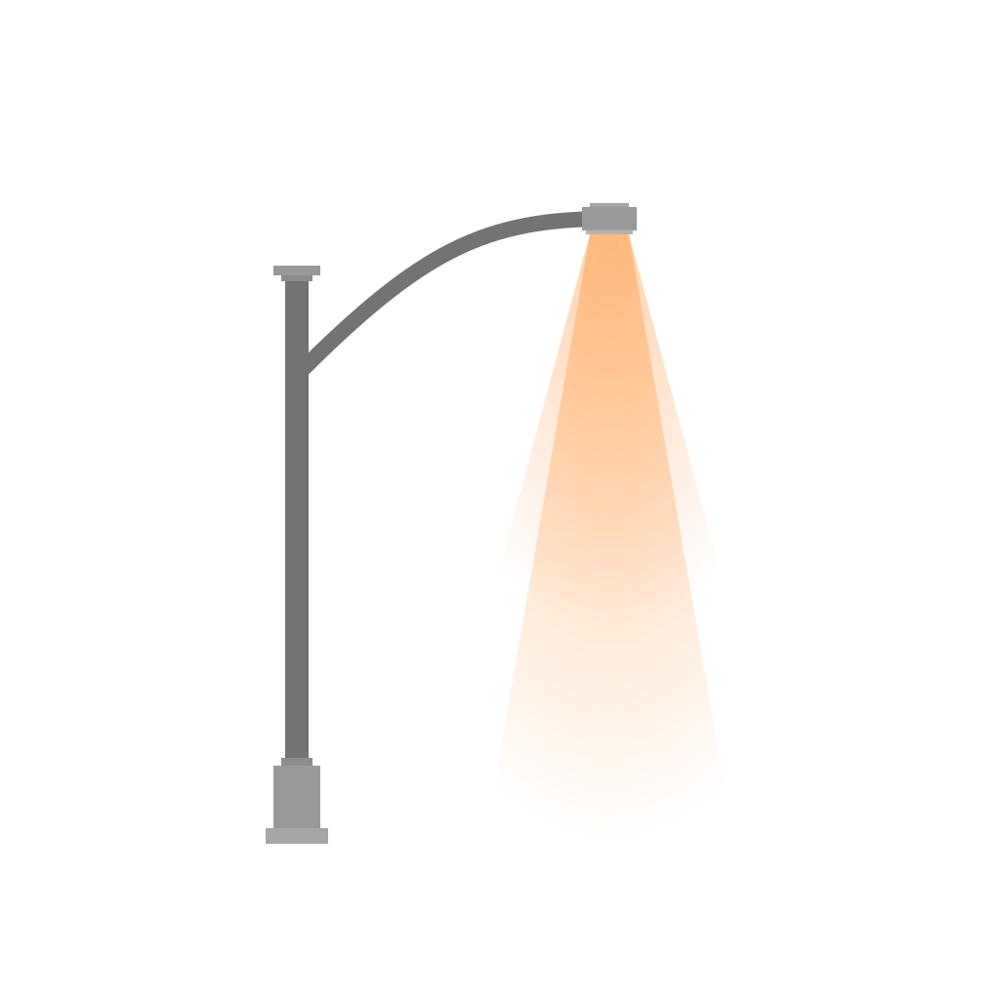
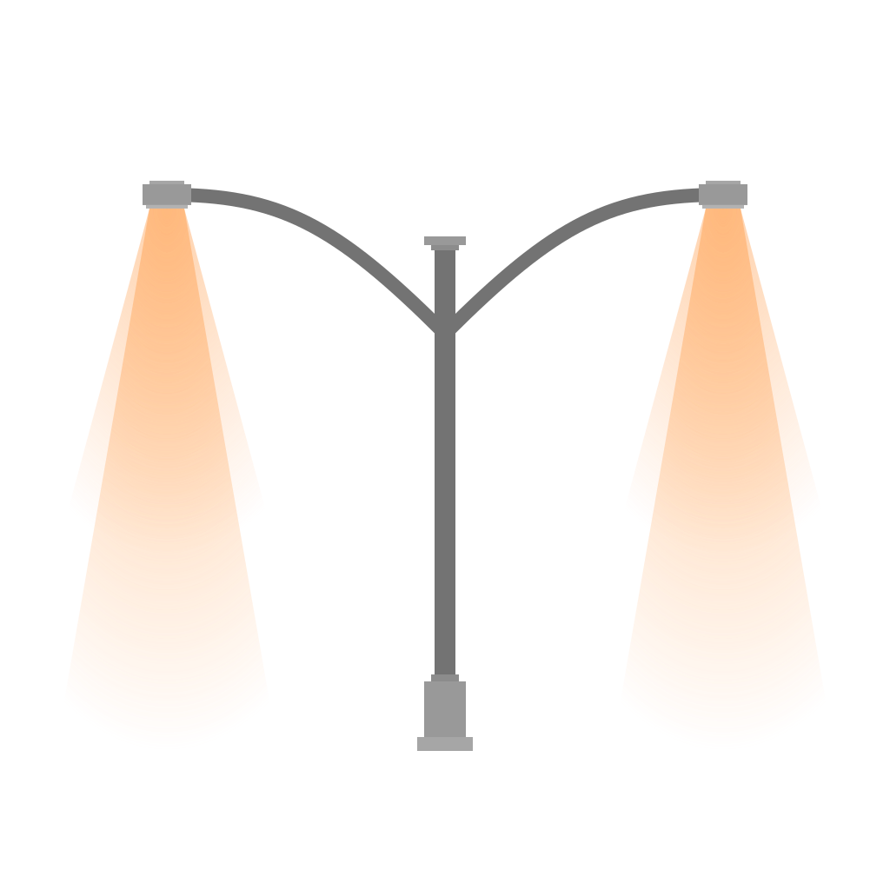

# OpenStreetMap

Personal repository for OpenStreetMap-related things.

## Presets

### General

* **[3D Building Details](https://github.com/Lumikeiju/openstreetmap/blob/main/presets/3d_building_details.xml)** | *(3d_building_details.xml)* | [Simple 3D Buildings](https://wiki.openstreetmap.org/wiki/Simple_3D_Buildings) tagging preset

* **[LGBTQ+](https://github.com/Lumikeiju/openstreetmap/blob/main/presets/lgbtq.xml)** | *(lgbtq.xml)* | `lgbtq*=*`-focused tagging preset

* **[Public Transport](https://github.com/Lumikeiju/openstreetmap/blob/main/presets/public_transport.xml)** | *(public_transport.xml)* | Public transport features tagging preset

* **[Rooftop Solar Panel](https://github.com/Lumikeiju/openstreetmap/blob/main/presets/rooftop_solar_panel.xml)** | *(rooftop_solar_panel.xml)* | Preset for quickly adding rooftop solar panels

* **[Tree](https://github.com/Lumikeiju/openstreetmap/blob/main/presets/tree.xml)** | *(tree.xml)* | `natural=tree`-focused tagging preset

### Specific

* **[Seattle Stops and Signs](https://github.com/Lumikeiju/openstreetmap/blob/main/presets/seattle_stops_and_signs.xml)** | *(seattle_stops_and_signs.xml)* | `traffic_sign:*=*`-focused preset mainly intended for use in Seattle, WA

* **[SCL Poles](https://github.com/Lumikeiju/openstreetmap/blob/main/presets/seattle_city_light_pole.xml)** | *(seattle_city_light_pole.xml)* | `light:*=*`-focused preset intended mainly for use in Seattle, WA

* **[US-WA Addresses](https://github.com/Lumikeiju/openstreetmap/blob/main/presets/us-wa_addr.xml)** | *(us-wa_addr.xml)* | `addr:*=*` Simple address tagging preset with WA-US defaults

* **[US-WA GTFS](https://github.com/Lumikeiju/openstreetmap/blob/main/presets/us-wa_gtfs.xml)** | *(us-wa_gtfs.xml)* | `US-WA-*` GTFS tagging preset for public transport features 

## Guides

* **[King County DSM](https://github.com/Lumikeiju/openstreetmap/blob/main/guides/king_county_dsm.md)** | *(king_county_dsm.md)* | Clipping a `.tif` (such as a large DSM) in QGIS and importing it into JOSM

## Validators

* **[Typo Fixer](https://github.com/Lumikeiju/openstreetmap/blob/main/validators/typo_fixer.validator.mapcss)** | *(typo_fixer.validator.mapcss)* | Validator rules suggesting typo fixes

* **[Public Transport](https://github.com/Lumikeiju/openstreetmap/blob/main/validators/public_transport.validator.mapcss)** | *(public_transport.validator.mapcss)* | Validator rules for removing unnecessary `bus=yes` tags on some public transport elements

* **[Contact Prefix](https://github.com/Lumikeiju/openstreetmap/blob/main/validators/contact_prefix.validator.mapcss)** | *(contact_prefix.validator.mapcss)* | Validator rules suggesting `contact:` prefix

* **[SCL Poles](https://github.com/Lumikeiju/openstreetmap/blob/main/validators/seattle_city_light_pole.validator.mapcss)** | *(seattle_city_light_pole.validator.mapcss)* | Validator rules for Seattle City Light Poles data

* **[Tiger Cleanup](https://github.com/Lumikeiju/openstreetmap/blob/main/validators/tiger_cleanup.validator.mapcss)** | *(tiger_cleanup.validator.mapcss)* | Validator rules for TIGER import cleanup

* **[Route Reference Reformatter](https://github.com/Lumikeiju/openstreetmap/blob/main/validators/route_ref_reformatter.validator.mapcss)** | *(route_ref_reformatter.validator.mapcss)* | Validator rule which reformats the delimiter in `route_ref`

## Visualizations

Style documents for use on [Ultra](https://overpass-ultra.us/). 

**How to use:** Replace the query on Overpass Ultra with the contents of the file. Navigate on the map to the desired area and hit "Run" at the top left.

Refer to the [MapLibre Style Spec documentation](https://maplibre.org/maplibre-style-spec/) for more details on customizing the visualization.

* **[Winter Service](https://github.com/Lumikeiju/openstreetmap/blob/main/visualizations/winter_service)** | *(winter_service)* | Visualization of `winter_service*=*` tags on roadways

## Styles

MapCSS-formatted paint styles for use in JOSM.

* **[TIGER Stripes](https://github.com/Lumikeiju/openstreetmap/blob/main/styles/tiger-stripes.mapcss)** | *(tiger-stripes.mapcss)* | Highlights highways with TIGER tags.

## Queries

### QA

#### Addresses

* **[City](https://github.com/Lumikeiju/openstreetmap/blob/main/queries/qa/addresses/city.overpassql)** | *(city.overpassql)* | `addr:city=*` value

* **[State](https://github.com/Lumikeiju/openstreetmap/blob/main/queries/qa/addresses/state.overpassql)** | *(state.overpassql)* | `addr:state=*` value

* **[Country](https://github.com/Lumikeiju/openstreetmap/blob/main/queries/qa/addresses/country.overpassql)** | *(country.overpassql)* | `addr:country=*` value

#### Public Transport

* **[Platform on Roadway](https://github.com/Lumikeiju/openstreetmap/blob/main/queries/qa/public_transport/platform_on_roadway.overpassql)** | *(platform_on_roadway.overpassql)* | `public_transport=platform` on roadway

* **[Stop Position not on Roadway](https://github.com/Lumikeiju/openstreetmap/blob/main/queries/qa/public_transport/stop_position_not_on_roadway.overpassql)** | *(stop_position_not_on_roadway.overpassql)* | `public_transport=stop_position` not on roadway

* **[Stop Position Role](https://github.com/Lumikeiju/openstreetmap/blob/main/queries/qa/public_transport/stop_position_role.overpassql)** | *(stop_position_role.overpassql)* | `public_transport=stop_position` role errors

## Resources

Icons, images, illustrations, etc.

### Icons

#### [OSM Heart](resources/icons/osmheart) and [OSM Pin](resources/icons/osmpin)

Also on Wikimedia Commons! [OSM Heart](https://commons.wikimedia.org/wiki/File:OSM_Heart.svg) | [OSM Pin](https://commons.wikimedia.org/wiki/File:OSM_Pin.svg)

#### [LGBTQ+](resources/icons/lgbtq)

Commons: [Heart (Horizontal)](https://commons.wikimedia.org/wiki/File:OSM_Heart_Horizontal_Pride.svg) | [Heart (Slanted)](https://commons.wikimedia.org/wiki/File:OSM_Heart_Slanted_Pride.svg) | [Pin (Horizontal)](https://commons.wikimedia.org/wiki/File:OSM_Pin_Horizontal_Pride.svg) | [Pin (Slanted)](https://commons.wikimedia.org/wiki/File:OSM_Pin_Slanted_Pride.svg)

### [Light Source Illustrations](resources/light_source_illustrations)

These are all also on [Wikimedia Commons](https://commons.wikimedia.org/wiki/Category:Drawings_of_street_lights)!

Street light color temperature illustrations created for [OSM Wiki - Key:light:colour](https://wiki.openstreetmap.org/wiki/Key:light:colour).

Street light count illustrations created for [OSM Wiki - Key:light:count](https://wiki.openstreetmap.org/wiki/Key:light:count).

